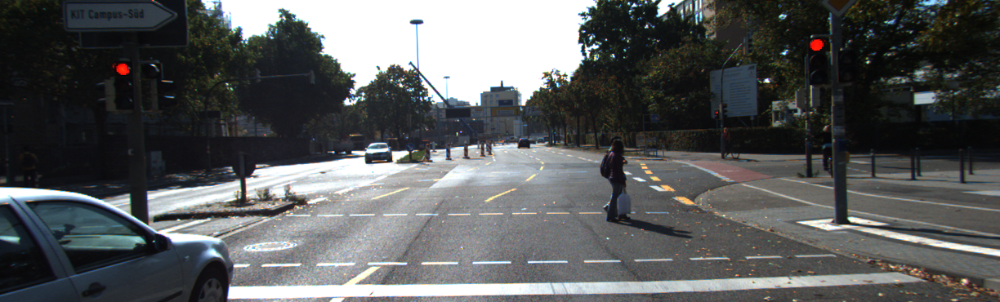
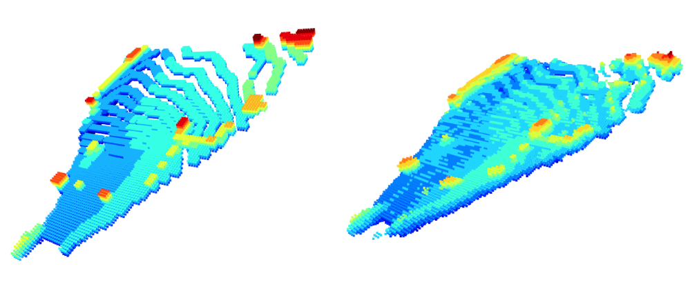
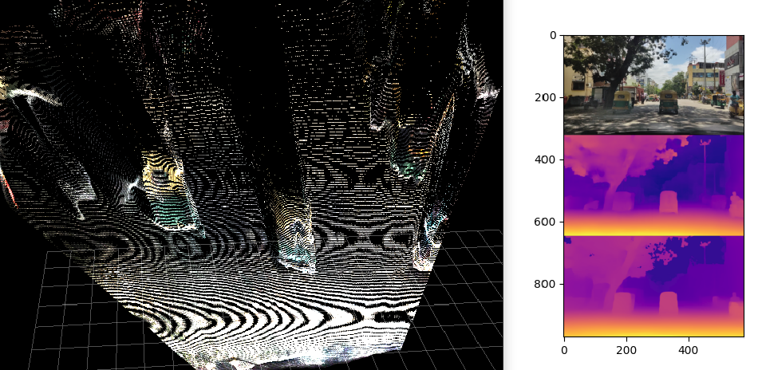

# OCTraN: 3D Occupancy Convolutional Transformer Network in Unstructured Traffic Scenarios




Modern approaches for vision-centric environment perception for autonomous navigation make extensive use of self-supervised monocular depth estimation algorithms to predict the depth of a 3D scene using only a single camera image. However, when this depth map is projected onto 3D space, the errors in disparity are magnified,  resulting in a depth estimation error that increases quadratically as the distance from the camera increases. Though Light Detection and Ranging (LiDAR) can solve this issue, it is expensive and not feasible for many applications. To address the challenge of accurate ranging with low-cost sensors, we propose a transformer architecture that uses iterative-attention to convert 2D image features into 3D occupancy features and makes use of convolution and transpose convolution to efficiently operate on spatial information. We also develop a self-supervised training pipeline to generalize the model to any scene by eliminating the need for LiDAR ground truth by substituting it with pseudo-ground truth labels obtained from neural radiance fields (NeRFs) and boosting monocular depth estimation. We will be making our code and dataset public

# Setup

Get all submodules
```
git submodule update --init --recursive
```

Setup environment
```
pip install requirements.txt
```


# Bengaluru Depth Dataset Dataset

 - Raw dataset link - (Removed for double blind review)
 - Depth Dataset link - (Removed for double blind review)
 - Mini Depth Dataset link - https://bit.ly/OCTraN-Dataset

Download the Mini Depth Dataset and place it at `~/Datasets/Depth_Dataset_Bengaluru/1658384924059`

Run visualizer to view 3D point cloud
```shell
cd dataset_pipeline/
python3 -m dataset_helper.dataset_iterators
```
The visualizer wo;; plot out the RGB, Boosted Disparity and non-boosted Disparity frame (in that order) from the dataset and the corresponding 3D point cloud, as shown below:



# OCTraN Model

Train our model on the Raw KITTI dataset
```
export CUBLAS_WORKSPACE_CONFIG=:4096:8 # Determinism

CUDA_VISIBLE_DEVICES=0 python3 -m OCTraN.scripts.train_OCTraN_B --sweep_json configs/March_20/sweep_config_OCTraN_B.json
CUDA_VISIBLE_DEVICES=0 python3 -m OCTraN.scripts.train_OCTraN_V0 --sweep_json configs/March_20/sweep_config_OCTraN_V0.json
CUDA_VISIBLE_DEVICES=0 python3 -m OCTraN.scripts.train_OCTraN_V1 --sweep_json configs/March_20/sweep_config_OCTraN_V1.json
```

# Acknowledgements

Our work builds on and uses code from the following. We'd like to thank the authors for making these libraries available.
 - <a href="https://github.com/lucidrains/perceiver-pytorch/">Perceiver</a>
 - <a href="https://github.com/lucidrains/vit-pytorch/">ViT</a>
 - <a href="https://github.com/compphoto/BoostingMonocularDepth">BoostingMonocularDepth</a>
 - <a href="https://github.com/compphoto/BoostYourOwnDepth">BoostYourOwnDepth</a>
 - <a href="https://github.com/luigifreda/pyslam">pyslam</a>

# Citation
Please cite our paper if you find this repo helpful:

```
TODO
```